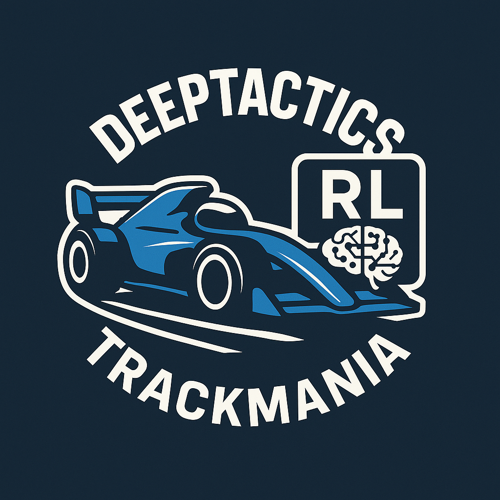

<div align="center">


[](https://opensource.org/licenses/MIT)
[](https://img.shields.io/badge/version-0.1.0-blue)


</div>

<details>
<summary><b>📋 Table of Contents</b></summary>

- [🎯 Project Goals](#-project-goals)
- [🧠 Project Description](#-project-description)
- [🏗️ Architecture & Tech Stack](#️-architecture--tech-stack)
- [📚 Key Resources](#-key-resources)
- [🛠️ Prerequisites](#️-prerequisites)
- [🚀 Getting Started](#-getting-started)
- [💻 Usage](#-usage)
- [🏎️ TrackMania Setup (Optional)](#️-trackmania-setup-optional)
- [🧪 Testing](#-testing)
- [📖 Documentation](#-documentation)
- [🏗️ Project Structure](#️-project-structure)
- [🎓 Algorithm Overview](#-algorithm-overview)
- [🔧 Troubleshooting](#-troubleshooting)
- [📝 Contributing](#-contributing)
- [👥 Team](#-team)
- [License](#license)

</details>

# DeepTactics-TrackMania

🚗 **Deeptactics Trackmania** is a student-driven project exploring **Reinforcement Learning (RL)** in the racing game **Trackmania**.
Our goal is to design, train, and visualize agents capable of completing tracks, improving over time, and eventually outperforming human players in our group.

## 🎥 Agent in Action

https://github.com/user-attachments/assets/46ba0920-8d88-4be0-bf82-93d533b90429

<div align="center">
  <p><i>Our Rainbow DQN agent navigating a TrackMania track</i></p>
</div>

---

## 🎯 Project Goals

- **Main Goal:**  
  Build an RL system that can successfully complete a Trackmania track.

- **Subgoals:**
  - Achieve competitive performance on challenging tracks
  - Visualize trained agents playing inside the game
  - Document training progress and results
  - Support both local and HPC cluster training  

---

## 🧠 Project Description

We train RL agents using multiple deep Q-learning methods in **Trackmania** and various **Gymnasium** environments.
The project emphasizes:

- Implementing state-of-the-art RL algorithms from scratch (DQN, IQN, Rainbow).
- Building shared knowledge through research workshops and collaborative development.
- Using Weights & Biases dashboards to monitor training progress and metrics.
- Combining technical learning with social team-building.
- Ensuring every team member can understand, modify, and train agents independently.

---

## 🏗️ Architecture & Tech Stack

**Environments:**
- **Gymnasium** (v1.2.2+): LunarLander, CarRacing, CartPole, Acrobot, MountainCar, Ant (MuJoCo)
- **TMRL** (custom fork): Real TrackMania game integration via RTGym interface

**RL Algorithms Implemented:**
- **DQN**: Deep Q-Network with optional Dueling + Prioritized Replay + Double DQN
- **IQN**: Implicit Quantile Networks with distributional RL and noisy exploration
- **Rainbow DQN**: Combines IQN, Dueling, PER, DDQN, N-step returns, and noisy layers
  - CarRacing variant: CNN-based for image observations
  - TrackMania variant: Multi-input (images + car features + action history)

**Tech Stack:**
- **Framework:** PyTorch 2.7.0+, TorchRL 0.10.1+
- **Experiment Tracking:** Weights & Biases (WandB)
- **Environment Manager:** UV (Python package manager)
- **Development Tools:** Pre-commit hooks, pytest, Git
- **Deployment:** SLURM cluster support (NTNU HPC with V100 GPUs)

---

## 📚 Key Resources

**Research Papers:**
- [DQN Paper (Mnih et al.)](https://arxiv.org/abs/1312.5602) - Original Deep Q-Network
- [Dueling DQN (Wang et al.)](https://arxiv.org/abs/1511.06581) - Value/Advantage decomposition
- [Prioritized Experience Replay (Schaul et al.)](https://arxiv.org/abs/1511.05952)
- [IQN Paper (Dabney et al.)](https://arxiv.org/abs/1806.06923) - Implicit Quantile Networks
- [Rainbow DQN (Hessel et al.)](https://arxiv.org/abs/1710.02298) - Combining improvements
- [IMPALA (Espeholt et al.)](https://arxiv.org/abs/1802.01561) - CNN architecture

**Frameworks & Tools:**
- [TMRL Framework](https://github.com/trackmania-rl/tmrl) - TrackMania RL interface
- [Gymnasium Documentation](https://gymnasium.farama.org) - Environment library
- [Linesight RL (YouTube)](https://www.youtube.com/@linesight-rl) - RL tutorials
- [TMUnlimiter](https://unlimiter.net/) - TrackMania tools

---

## 🛠️ Prerequisites

- **Git**: Version control system. [Download Git](https://git-scm.com/downloads)
- **Python 3.13+**: Required for the project. [Download Python](https://www.python.org/downloads/)
- **UV**: Python package and environment manager. [Install UV](https://docs.astral.sh/uv/getting-started/installation/)
- **CUDA** (recommended): For GPU-accelerated training on Windows/Linux
- **TrackMania 2020** (optional): Required only for TrackMania training
  - Free version available at [trackmania.com](https://www.trackmania.com/)
  - **OpenPlanet Plugin**: Required for TMRL integration. [Download](https://openplanet.nl/)
  - **See [TMRL Setup Guide](docs/TMRL_SETUP.md)** for complete installation instructions

---

## 🚀 Getting Started

### 1. Clone the Repository

```bash
git clone https://github.com/CogitoNTNU/DeepTactics-TrackMania.git
cd DeepTactics-TrackMania
```

### 2. Install Dependencies

The project uses `uv` for dependency management. PyTorch will be installed with the appropriate backend:
- **Windows**: CUDA 13.0
- **Linux**: ROCm 6.4 (AMD GPUs)
- **macOS**: CPU-only

```bash
uv sync
```

### 3. Set Up Pre-commit Hooks (Development Only)

```bash
uv run pre-commit install
```

### 4. Create Configuration Files

Generate configuration files from templates:

```bash
uv run create_configs.py
```

This creates:
- `config_files/config.py` - Configuration for Gymnasium environments
- `config_files/tm_config.py` - Configuration for TrackMania

### 5. Configure Your Training

**All training settings are controlled from a single config file** - no need to edit TMRL's `config.json` or other files!

Edit the generated config files to customize your training:

**For Gymnasium environments** ([config_files/config.py](config_files/config.py)):
```python
# Environment selection
env_name = "LunarLander-v3"  # Or: CarRacing-v3, CartPole-v1, etc.

# Algorithm selection
use_DQN = False              # Standard DQN
use_IQN = True               # Implicit Quantile Networks (recommended)

# Algorithm features
use_dueling = True           # Dueling architecture
use_prioritized_replay = True
use_doubleDQN = True

# Hyperparameters
learning_rate = 0.0001
batch_size = 32
discount_factor = 0.997
epsilon_decay_steps = 250_000

# Network architecture
hidden_dim = 128

# Training control
checkpoint = True
resume_from_checkpoint = False  # Set True to continue from checkpoint
```

**For TrackMania** ([config_files/tm_config.py](config_files/tm_config.py)):
```python
# Algorithm features
use_dueling = True
use_prioritized_replay = True
use_doubleDQN = True

# TrackMania-specific
crash_detection = True       # Penalize velocity drops (crashes)
crash_threshold = 10.0       # Velocity drop threshold
crash_penalty = 10           # Penalty for crashes

# Network architecture
hidden_dim = 256
conv_channels_1 = 16
conv_channels_2 = 32
car_feature_hidden_dim = 256
action_history_hidden_dim = 256
act_buf_len = 4

# Hyperparameters
learning_rate = 0.0001
batch_size = 64
discount_factor = 0.997
n_step_buffer_len = 4
epsilon_decay_steps = 2_000_000

# Training control
checkpoint = True
checkpoint_frequency = 10    # Save every N episodes
resume_from_checkpoint = False
```

**That's it!** All settings are in one place. No need to configure TMRL's `config.json` separately.

---

## 💻 Usage

### Running Training

The main entry point is [main.py](main.py). Toggle between TrackMania and Gymnasium training:

```python
# In main.py
run_tm = False  # Set to True for TrackMania, False for Gymnasium
```

**Start training:**

```bash
uv run main.py
```

### Training Modes

**Gymnasium Training** (vector and image environments):
- Automatically selects agent based on config (DQN/IQN/Rainbow)
- Supports 6 environments: LunarLander, CarRacing, CartPole, Acrobot, MountainCar, Ant
- Tracks metrics to WandB (requires login: `wandb login`)

**TrackMania Training** (Windows only):
- Requires TrackMania 2020 with OpenPlanet plugin
- Uses Rainbow agent with multi-input architecture
- Integrates replay buffer saving for crash recovery
- See [TMRL Setup Guide](docs/TMRL_SETUP.md) for detailed installation instructions

### Monitoring Progress

Training metrics are logged to [Weights & Biases](https://wandb.ai):
- Episode rewards
- Q-value estimates
- Loss curves
- Epsilon decay
- Race completion times (TrackMania)

### Checkpointing

Checkpoints are automatically saved to `checkpoints/` directory:
- `checkpoint_latest.pt` - Most recent checkpoint (for resuming)
- `checkpoint_episode_N.pt` - Periodic snapshots
- `checkpoint_final.pt` - End of training

To resume from checkpoint, set in config:
```python
resume_from_checkpoint = True
```

---

## 🏎️ TrackMania Setup (Optional)

To train agents in the actual TrackMania 2020 game, follow these additional steps:

### Quick Setup

1. **Install TrackMania 2020**
   - Download from [trackmania.com](https://www.trackmania.com/) (free version works)
   - Launch the game at least once to complete initial setup

2. **Install Visual C++ Runtime** (Windows prerequisite)
   ```bash
   # Download and install from:
   # https://aka.ms/vs/16/release/vc_redist.x64.exe
   ```

3. **Install OpenPlanet Plugin**
   - Download from [openplanet.nl](https://openplanet.nl/)
   - During installation, click "More Info" → "Install Anyway" if prompted about unsigned certificate
   - Verify installation: Launch TM2020, press `F3`, should see OpenPlanet menu

4. **Initialize TMRL Environment**
   ```bash
   uv run python -m tmrl --install
   ```

   This creates `~/TmrlData/` folder with:
   - Pre-trained models (for testing)
   - OpenPlanet plugins (`TMRL_GrabData.op`, `TMRL_SaveGhost.op`)
   - Configuration templates
   - Test maps

5. **Verify OpenPlanet Integration**
   - Launch TrackMania 2020 and any track
   - Press `F3` → `Developer` → `(Re)load plugin` → `TMRL Grab Data`
   - Should see "waiting for incoming connection" in `OpenPlanet > Log`

6. **Configure Training Settings**

   **All training settings are in `config_files/tm_config.py`** - you don't need to edit TMRL's `config.json`!

   Our project uses a **custom Rainbow DQN agent** instead of TMRL's default SAC. All hyperparameters, network architecture, and training settings are controlled from the single config file:

   ```python
   # In config_files/tm_config.py

   # Algorithm features
   use_dueling = True
   use_prioritized_replay = True
   crash_detection = True

   # Network architecture
   hidden_dim = 256
   batch_size = 64

   # Training hyperparameters
   learning_rate = 0.0001
   discount_factor = 0.997
   epsilon_decay_steps = 2_000_000

   # See config_files/static_tm_config.py for all available options
   ```

7. **Run Training**
   ```bash
   # In main.py, set:
   run_tm = True

   # Then start training:
   uv run main.py
   ```

### Detailed Setup Guide

For complete installation instructions, configuration options, troubleshooting, and advanced features, see:

**[📘 Complete TMRL Setup Guide](docs/TMRL_SETUP.md)**

This includes:
- Linux installation (Steam/Proton)
- Network configuration for distributed training
- Custom reward function recording
- Performance tuning
- Security configuration (TLS/passwords)
- Environment types (FULL vs LIDAR)

---

## 🧪 Testing

Run the test suite:

```bash
uv run pytest --doctest-modules --cov=src --cov-report=html
```

View coverage report:
```bash
open htmlcov/index.html  # macOS/Linux
start htmlcov/index.html # Windows
```

## 📖 Documentation

Build and preview the documentation site locally:

```bash
uv run mkdocs build
uv run mkdocs serve
```

This starts a local server at [http://127.0.0.1:8000/](http://127.0.0.1:8000/) with the docs and API reference.

View the latest published documentation: [https://cogitontnu.github.io/DeepTactics-TrackMania/](https://cogitontnu.github.io/DeepTactics-TrackMania/)

---

## 🏗️ Project Structure

```
DeepTactics-TrackMania/
├── src/
│   ├── agents/
│   │   ├── DQN.py              # Deep Q-Network agent
│   │   ├── IQN.py              # Implicit Quantile Networks
│   │   ├── rainbow.py          # Rainbow for CarRacing
│   │   └── rainbow_tm.py       # Rainbow for TrackMania
│   ├── helper_functions/
│   │   ├── tm_actions.py       # TrackMania action mapping
│   │   ├── tm_checkpointing.py # Checkpoint utilities
│   │   └── ant_wrappers.py     # Discrete action wrapper for Ant
│   ├── env.py                  # Gymnasium training script
│   └── env_tm.py               # TrackMania training script
├── config_files/
│   ├── static_config.py        # Gymnasium config template
│   └── static_tm_config.py     # TrackMania config template
├── main.py                     # Main entry point
├── create_configs.py           # Config generation script
├── run_slurm.slurm            # SLURM cluster deployment
└── pyproject.toml             # Dependencies and project metadata
```

---

## 🎓 Algorithm Overview

### DQN (Deep Q-Network)
Standard Q-learning with neural network approximation. Supports:
- **Dueling architecture**: Separates value and advantage streams
- **Prioritized Experience Replay**: Samples important transitions more frequently
- **Double DQN**: Reduces overestimation bias

### IQN (Implicit Quantile Networks)
Distributional RL that learns the full distribution of Q-values:
- **Quantile regression**: More stable than expectation-based methods
- **Noisy layers**: Built-in exploration without epsilon-greedy
- **Cosine embedding**: Encodes quantile values

### Rainbow DQN
Combines multiple improvements for state-of-the-art performance:
- IQN (distributional RL)
- Dueling architecture
- Prioritized Experience Replay
- Double DQN
- N-step returns
- Noisy layers for exploration
- **TrackMania variant**: Multi-input (images + car state + action history)

## 🔧 Troubleshooting

### Common Issues

**"ModuleNotFoundError: No module named 'tmrl'"**
- TMRL is only required for TrackMania training
- Set `run_tm = False` in [main.py](main.py) to use Gymnasium environments instead

**"CUDA out of memory"**
- Reduce `batch_size` in config (e.g., from 64 to 32)
- Use smaller `hidden_dim` (e.g., 128 instead of 256)
- Close other GPU-intensive applications

**Training diverges / Q-values explode**
- The project uses **hard target network updates** by default (`tau = 1.0` in config)
- Hard updates copy the entire policy network to target network periodically
- For soft updates, set `tau` to a small value (e.g., `0.001` or `0.005`):
  - `tau = 1.0` → Hard update (full copy, **recommended and default**)
  - `tau = 0.005` → Soft update (θ_target = 0.005*θ_policy + 0.995*θ_target)
  - `tau = 0.0` → No update (target network never changes)
- **Warning**: Soft updates (`tau < 1.0`) can cause training instability and Q-value divergence
- Use constant learning rate (no decay scheduler) for stable training

**WandB not logging**
- Run `wandb login` and enter your API key
- Set `wandb_logging = True` in config
- Check internet connection

**TrackMania connection issues**
- Ensure TrackMania Nations Forever is running
- Install TMInterface plugin
- Check that TMRL server is configured correctly

---

## 📝 Contributing

We welcome contributions! This is a learning-focused project where collaboration is key.

**Guidelines:**
- Every line of code should be understandable by all team members
- Document your changes and explain the reasoning
- Run tests before submitting: `uv run pytest`
- Format code with pre-commit hooks: `uv run pre-commit run --all-files`

**Areas for Contribution:**
- Algorithm improvements and hyperparameter tuning
- New environment support
- Visualization tools
- Documentation and tutorials

---

## 👥 Team

This project would not have been possible without the hard work and dedication of all contributors.
Thank you for the time and effort you have put into making this project a reality.

<table align="center">
    <tr>
        <td align="center">
            <a href="https://github.com/ludvigovrevik">
              <br />
              <sub><b>Ludvig Øvrevik</b></sub>
            </a><br />
            <sub>Project Lead</sub>
        </td>
        <td align="center">
            <a href="https://github.com/bragekvamme">
              <br />
              <sub><b>Brage Kvamme</b></sub>
            </a><br />
            <sub>Project Lead</sub>
        </td>
        <td align="center">
            <a href="https://github.com/edvard-ek">
              <br />
              <sub><b>Edvard Klavenes</b></sub>
            </a><br />
            <sub>Project Member</sub>
        </td>
        <td align="center">
            <a href="https://github.com/HenrikOen">
              <br />
              <sub><b>Henrik Øen</b></sub>
            </a><br />
            <sub>Project Member</sub>
        </td>
        <td align="center">
            <a href="https://github.com/simenfv">
              <br />
              <sub><b>Simen Førdestrøm Verhoeven</b></sub>
            </a><br />
            <sub>Project Member</sub>
        </td>
    </tr>
    <tr>
        <td align="center">
            <a href="https://github.com/EldarAlvik">
              <br />
              <sub><b>Eldar Alvik</b></sub>
            </a><br />
            <sub>Project Member</sub>
        </td>
        <td align="center">
            <a href="https://github.com/pilotCapp">
              <br />
              <sub><b>Kristoffer Seyffarth</b></sub>
            </a><br />
            <sub>Project Member</sub>
        </td>
    </tr>
</table>


<div align="center">
  
</div>

### License

---

Distributed under the MIT License. See `LICENSE` for more information.
